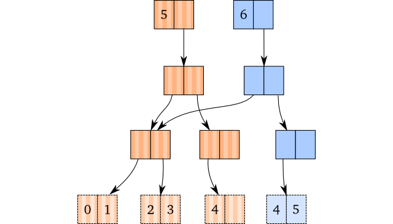

#[fit] Code Defines Fun

###[fit] Through Clojure and Functional Programming

---

#[fit] Code Defines Fun

###[fit] Through Clojure and Functional Programming

---

# Code Defines 😀


---

# Code Defines 😏


---

# Code Defines 😴 🤗


---

#[fit] Code Defines Fun

---

<br>
So many ways to have FUN

* Travels
* Sports
* Games
* Music
* Movies
* Books
* ...

---

<br>
Even just software related

* Solve hard problem
* Solve small problem
* Build product that people love
* Earn a lot of money
* Build something cool
* And so on ...

---

<br>
<br>
<br>
I just want to share one perspective of fun

---

<br>
<br>
<br>
I just want to share one perspective of fun

with code

---


---

# Aspects of FUN

- Confident
- Feedback & Interactivity
- Powerful
- Front-end
- Innovation

---

# Clojure

* Functional language
* Lisp dialect
* Mainly compile to JVM byte code and JavaScript
  * Hosted, embraces host language
* Data oriented

---

<br>
<br>
<br>
<br>

```Clojure
(println "Hello," "World")
```

---

# Function
<br>

```Clojure
(defn say-hello [name]
  (println "Hello," name))
```

<br>

```Clojure
#(println "Hello," %)
```

---

<br>
<br>

```clojure
(if "check"
 "if true"
 "if false")

(let [a (* 2 3 4)
      b (+ 5 6 7)]
  (< b a))
```

---

# Data structures

```clojure

["Orange" "Apple" "Microsoft"]

(:microsoft :megasoft :terrasoft)

{1 "Monday" 2 "Tuesday" 3 "Wednesday" 4 "Thursday"
 5 "Friday" "6" "Saturday" :7 "Sunday"}
```

```clojure
#{"Pen" "Apple" "Apple Pen"}
```

---

Demo

---

# Aspects of FUN

- _**Confident**_
- Feedback & Interactivity
- Powerful
- Front-end
- Innovation

---

# Confident

* Immutable & Persistent data structure
* Short code
* Encourage pure function and no side-effects

---

### Immutable & Persistent data structure

* Any operation on a data structure only efficiently creates a new one
* No more Encapsulation!
* No more defensive copy
* Simple concurrency

---

# Example[^*]

<br>
<br>
<br>

```Clojure
(conj [0 1 2 3 4] 5)

```



[^*]: http://hypirion.com/musings/understanding-persistent-vector-pt-1

---

<br>

```Clojure
(get {:a 1 :b 2} :a)
(assoc {:a 1 :b 2} :c 3)
```
```Clojure
(get-in {:a {:b {:c {:d 5}}}} [:a :b :c :d])
(assoc-in {:a {:b {:c {:d 5}}}} [:a :b :c :d] 6)
```
```clojure
(update-in {:a {:b {:c {:d 5}}}} [:a :b :c :d] inc)
(update-in {:a {:b [{:z 1} {:y {:x 10}}]}}
           [:a :b 1 :y :x]
           #(if (odd? %) (inc %) (dec %)))
```

---

<br>

> It is better to have 100 functions operate on one data structure than 10 functions on 10 data structures.

-- Alan J. Perlis[^*]

[^*]: http://www.cs.yale.edu/homes/perlis-alan/quotes.html

---

# Collection functions

<br>

```clojure
(group-by :name [{:name "David" :age 36}
                 {:name "Michael" :age 40}
                 {:name "David" :age 25}])
```
```clojure
(frequencies (take 50 (repeatedly #(first (shuffle (range 10))))))
```
```clojure
(partition 4 (range 18))
```

---

### Some data structures are also function

```clojure
(filter even? (range 20))

(#{3 8 6} 6)            (#{3 8 6} 5)

(filter #{3 8 6} (range 10))

(filter (comp #{3 8 6} :id)
        [{:id 2 :name "Adam"}
         {:id 3 :name "Albert"}
         {:id 4 :name "Alex"}])
```

---

<br>

```clojure
({1 "Monday" 2 "Tuesday" 3 "Wednesday" 4 "Thursday"
  5 "Friday" 6 "Saturday" 7 "Sunday"} 7)


(map {1 "Monday" 2 "Tuesday" 3 "Wednesday" 4 "Thursday"
      5 "Friday" 6 "Saturday" 7 "Sunday"}
     [2 4 6])
```

---

Demo

---

# Short code

* Readable with less code always the best
* Not Code golf
* REPL helps one that less clear

---

# Less boilerplate
* Syntax
  * Comparable to other dynamic typing languages and some advance static typing languages
  * Little impact
* Macro

---

## Macro

```Clojure
(or (= 0 1) (not= "Code" "Code"))
```

<br>


```clojure
(frequencies (take 50 (repeatedly #(first (shuffle (range 10))))))

(->> (repeatedly #(-> 10 (range) (shuffle) (first)))
     (take 50)
     (frequencies))
```

---

```java
Map charNumber = new HashMap();
charNumber.put("A", 1);
charNumber.put("A", 2);
charNumber.put("A", 3);
```

<br>

```Clojure
(doto (java.util.HashMap.)
    (.put "A" 1)
    (.put "B" 2)
    (.put "C" 3))
```

---

Demo

---


## Reusable structure

* How many times you have to close file? How to extract that in one place?
* Small core language
  * stable
  * extensible
* Example: Redis library

```Clojure
(wcar {:spec {:db 4}}
  (set "key" "val")
  (lpush "lkey" 1))
```

---

## Encourage pure function
## and no side-effects

---

## Pure function

* A function which returns the same output for a same set of inputs and do nothing else
* No side-effects

---

## Example of side-effects

* Read / Write from to IO (file, database, http)
* Print to console `(println)`
* Input from keyboard. Button click
* Setter method
* Many more ...

---

### What are the problems caused by poorly organized side-effects?

* Hard to reuse
* Hard to understand
* Hard to change
* Hard to test
* Hard to play with
  * Hard to setup
  * Unknown consequence

---

* We need side-effects but have to take a special care of them
* Clojure doesn't prevent side-effects or impure functions, just an idiomatic
* You have power, use it wisely
* Immutable data structure helps
* Provides state management utilities

---

# Aspects of FUN

- Confident
- _**Feedback & Interactivity**_
- Powerful
- Front-end
- Innovation

---

* Game is fun because we have feedback and control
* Our work is fun too when we have feedback and control

Hyper productivity talk
พี่จั๊ว -- Chokchai Phatharamalai

<br>

Feedback is everywhere. We MUST always looks for it.

---

## Example of feedback

* Fix a bug and know immediately it works
* Make a change and know we break old feature
* Make a change and know immediately it's faster / slower
* Have an idea and know immediately how it looks like
* Build product and know immediately if user likes it
* Do work and know our boss / client love it

---

# REPL

* Read, eval, print, loop
* Inherited from Lisp

---

# Why is it different?

* Scope
  * Biggest different
  * Lisp - Parentheses make it easy to choose scope
* Dev server in REPL
  * Debugging

---

# Why is it different?

* Immutable data & State management discipline
  * If a method is replaced, what are steps need to be performed to achieve previous state
  * E.g. 1, if a replaced method is a part of function which is called by constructor
  * E.g. 2, if a replaced method is a part of function which is called by server startup

---

# Why is it different?

* Change behavior of running code
  * NASA patched Lisp code
* Just no good tools

---

# Aspects of FUN

- Confident
- Feedback & Interactivity
- _**Powerful**_
- Front-end
- Innovation

---

# Powerful

* Concurrency
* Leverage power of host platform
* Extensibility

---

### Concurrency support with ease

* CRUD app handles by database
* Many primitives
* We don't have time so I pick the most important one
* Atom

---

## Atom

* Mutable reference to immutable data
* Check, Set or Retry
* Fearless multithread programming

---

<br>

```clojure
(def a (atom 1))
```

```clojure
@a
```

```clojure
(swap! a inc)

(fn [x] (+ x 1))

(swap! a (fn [x] (+ x 1)))
```

---

### Leverage power of host platform
* All JVM and JS libraries available

---

## Extensibility

* Macro
* core.async
  * Steal from Go
  * Implemented as a library
  * Useable on ClojureScript

---

Demo

---

# Aspects of FUN

- Confident
- Feedback & Interactivity
- Powerful
- _**Front-end**_
- Innovation

---

## ClojureScript

* Compiles Clojure to JavaScript
* Should work with all the JS runtimes
  * Node.js, React Native, Electron, Google Spreadsheet
* Used most in browser
* Uses Google Closure compiler / library
  * Behind Gmail
  * Dead code eliminations
  * Rich set of libraries

---

* Production ready JS compiler
  * CircleCI
* Share code between backend and fronted
  * E.g. Same HTML template, Websocket router, Data synchornization
* First time in my life that I have confident in my front-end code
* For backend guy, have similar fun
* Thanks to React ecosystem (+ ReactNative)
* Influences Immutable.js

---

Demo ClojureScript app

---

## Figwheel

* Hot-code reload
* Maintain state
* React style rendering (FP) + state management

---

# Aspects of FUN

- Confident
- Feedback & Interactivity
- Powerful
- Front-end
- _**Innovation**_

---

* Early industrial level of Persistent Data structures implementation
* Keep up latest great ideas
  * Go style CSP
  * React
* Stable core and backward compatibility in mind
  * Macro & Rich Hickey
* Keep up with future platforms
  * Hosted design

---

# Few last points

* Small community achieving big things
* Learn library not syntax
* One person can achieve more things

---

#[fit] FB: Clojure in Thai

#[fit] Thank you

---

# Credits

- https://pixabay.com/en/tooth-dentist-bite-zahntechnik-1501321/
- https://www.pexels.com/photo/2-man-playing-sparring-90772/
- https://www.pexels.com/photo/relaxation-relax-cats-cat-96428/
- http://www.joyofclojure.com/the-book/
